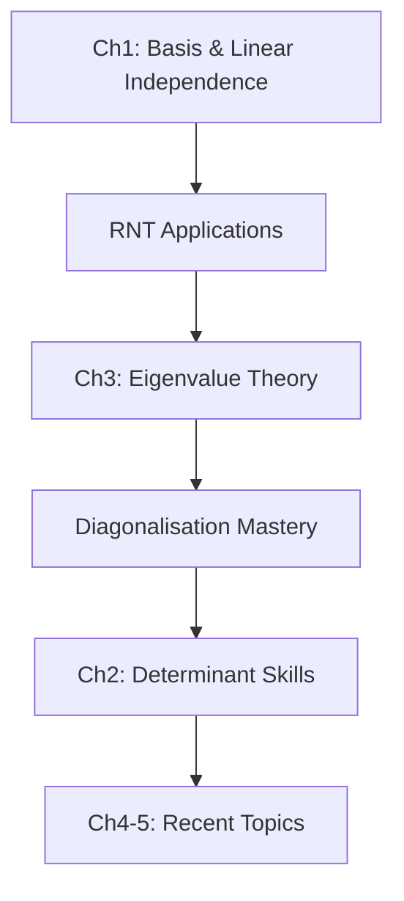

# MATH202 Algebra: Strategic Study Guide

## Executive Summary
Based on five years of past paper analysis, this guide provides a strategic approach to mastering MATH202 Algebra. Focus areas shift depending on exam timeline and evolving syllabus trends.

## Core Foundation (Essential for All Students)

### Chapter 1: Vector Spaces and Linear Maps (40-50% of exam)
**Must-Master Topics:**
1. **Definitions**
   - [[Basis]] (DEF-1.4.2) - appears in every exam
   - [[Linear subspace]] (DEF-1.2.6) - frequent True/False
   - [[Linear map]] (DEF-1.3.1) - essential for Section B
   
2. **Key Theorems**
   - [[Rank-Nullity Theorem]] (THM-1.9.2) - guaranteed appearance
   - Basis properties and characterizations
   
3. **Standard Procedures**
   - Testing linear independence
   - Finding bases for subspaces
   - Computing matrix representations

### Chapter 2: Determinants and Inverses (15-25% of exam)
**Critical Skills:**
1. **Computation Methods**
   - Row operations (PROP-2.2.3)
   - Cofactor expansion (PROP-2.4.2)
   - Properties exploitation (identical rows/columns)
   
2. **Applications**
   - Invertibility testing (COR-2.2.4)
   - Adjugate formula (COR-2.4.7)
   - Determinant properties in proofs

### Chapter 3: Eigenvalues and Diagonalisation (15-25% of exam)
**Essential Knowledge:**
1. **Core Concepts**
   - Eigenvalue/eigenvector computation (DEF-3.1.1)
   - Geometric vs algebraic multiplicity (DEF-3.4.4)
   - Diagonalisation criteria (THM-3.4.7)
   
2. **Practical Applications**
   - Testing diagonalisability
   - Finding diagonalisation matrices
   - Real vs complex field differences

## Emerging Essential Content (2021-2023 Trend)

### Chapter 4: Inner Product Spaces (15-25% in recent exams)
**Required Knowledge:**
1. **Definitions**
   - Inner product properties (DEF-4.1.1)
   - Orthonormal basis (DEF-4.2.1)
   - Orthogonal complement (DEF-4.2.9)
   
2. **Key Procedures**
   - Gram-Schmidt process (THM-4.2.6)
   - Testing inner product axioms
   - Constructing orthonormal bases

### Chapter 5: Linear Operators (10-15% in recent exams)
**Important Concepts:**
1. **Adjoint Properties**
   - Definition and computation (DEF-5.1.2)
   - Self-adjoint matrices (DEF-5.1.6)
   - Connection to complex conjugate transpose
   
2. **Advanced Topics**
   - Unitary/orthogonal matrices (DEF-5.1.8)
   - Spectral theorem implications (THM-5.2.11)

## Question-Type Strategies

### Section A Approach
**Q1 (True/False) - 6 marks**
- Review all definitions systematically
- Practice common traps and misconceptions
- 10 minutes maximum time allocation

**Q2-Q4 (Calculations) - ~15-20 marks**
- Master standard algorithms
- Practice speed and accuracy
- Common types: linear systems, determinants, eigenvalues

**Q5 (Examples/Constructions) - ~6 marks**
- Know standard counterexamples
- Practice diagonalisation examples
- Understand justification requirements

### Section B Approach
**Q6-Q7 (Theory/Applications) - ~15-20 marks each**
- Strong definition recall foundation
- Proof technique practice
- Multi-concept integration skills

## Time Management Strategy

### Study Phase (3+ months out)
1. **Foundation Building** (40% of time)
   - Master Ch1-Ch3 fundamentals
   - Complete all definition memorization
   - Practice basic calculations daily

2. **Procedure Mastery** (40% of time)
   - Eigenvalue algorithms
   - Determinant techniques
   - Gram-Schmidt (if Ch4-5 included)

3. **Proof Development** (20% of time)
   - Basic property proofs
   - Standard argument patterns

### Intensive Phase (1 month out)
1. **Past Paper Practice** (50% of time)
   - Complete papers under timed conditions
   - Analyze weak areas
   - Focus on recent format (2021-2023)

2. **Concept Integration** (30% of time)
   - Multi-chapter problems
   - Complex proof construction
   - Non-standard applications

3. **High-Frequency Review** (20% of time)
   - Rank-Nullity applications
   - Diagonalisation criteria
   - Adjoint properties (if recent trend continues)

### Final Week Strategy
1. **Definition Drill** (30%)
   - All key definitions quick recall
   - Common theorem statements

2. **Procedure Review** (40%)
   - Standard algorithms
   - Common calculation shortcuts

3. **Past Paper Simulation** (30%)
   - Full exam timing
   - Section strategy practice

## Content Priority Matrix

### Critical Path Concepts (Study First)


### Optional Enhancement Path
- Block matrix computations
- Advanced proof techniques
- Singular value decomposition
- Complex field applications

## Common Pitfalls and Solutions

### Conceptual Errors
1. **Basis vs Spanning Set**
   - Always verify linear independence
   - Count vectors vs dimension

2. **Similarity vs Equivalence**
   - Understand transformation types
   - Know property preservation

3. **Multiplicity Confusion**
   - Geometric ≤ Algebraic always
   - Use for diagonalisation testing

### Procedural Errors
1. **Determinant Calculation**
   - Sign errors in cofactor expansion
   - Row operation effect tracking

2. **Eigenvalue Problems**
   - Characteristic polynomial mistakes
   - Forgetting to solve for eigenvectors

3. **Proof Construction**
   - Missing definitions in arguments
   - Circular reasoning avoidance

## Success Indicators

### Before Exam
- [ ] Can recall 100% of Tier 1 definitions
- [ ] Score >80% on Section A practice
- [ ] Complete past paper in allocated time
- [ ] Demonstrate proof writing competency

### During Exam
- [ ] Finish Section A in 90 minutes
- [ ] Show work for all calculations
- [ ] Justify all statements in Section B
- [ ] Check answers if time permits

## Final Recommendations

1. **Prioritize** based on historical frequency
2. **Practice** under exam conditions
3. **Master** fundamentals before advanced topics
4. **Adapt** to recent trend toward Ch4-5 content
5. **Review** this guide regularly to track progress

Remember: Consistency in preparation and systematic approach to concept mastery will yield the best results in MATH202 Algebra examinations.
# ## Content Priority Matrix
## Detailed Study Resource Allocation

### Daily Practice Distribution
| Skill Area | Time % | Daily Focus |
|------------|---------|-------------|
| Definition Recall | 25% | Morning flashcards, evening review |
| Standard Calculations | 40% | Problem sets, timed exercises |
| Proof Writing | 20% | Structured practice, solution analysis |
| Past Paper Practice | 15% | 2-3 questions daily |

### Weekly Study Cycles

#### Week 1-2: Foundation Phase
- **Tier 1 Topics**: 70% of time
  - Master all Ch1 definitions
  - Complete Ch2 determinant methods
  - Begin Ch3 eigenvalue theory
- **Practice Focus**: Basic calculations, T/F questions
- **Self-Assessment**: Complete practice problems from each section

#### Week 3-4: Integration Phase
- **Tier 1 + Tier 2**: 60% + 30% split
  - Solidify RNT applications
  - Add inner product definitions
  - Practice diagonalisation
- **Practice Focus**: Section A complete questions
- **Self-Assessment**: Time yourself on full Section A

#### Week 5-6: Advanced Phase
- **All Tiers**: 50% + 35% + 15% distribution
  - Complex proof techniques
  - Ch4-5 applications
  - Mixed topic problems
- **Practice Focus**: Full past papers
- **Self-Assessment**: Complete 2019-2020 papers

## Content Priority Matrix
# ## Common Pitfalls and Solutions
## Advanced Practice Strategies

### Progressive Past Paper Approach
1. **Phase 1: Foundation (Weeks 1-2)**
   - Start with 2019-2020 papers (Ch1-3 focused)
   - Practice individual questions by type
   - Master True/False reasoning

2. **Phase 2: Integration (Weeks 3-4)**
   - Move to 2021-2023 papers (full curriculum)
   - Complete Section A under 90-minute time limit
   - Analyze Section B solution structures

3. **Phase 3: Mastery (Weeks 5-6)**
   - Full papers under exam conditions
   - Review and correct all mistakes
   - Create personal error log

### Archetype Practice Strategy
| Question Type | Daily Target | Weekly Review |
|--------------|--------------|---------------|
| True/False | 6-10 items | All misconceptions |
| Standard Calculations | 5-8 problems | Error patterns |
| Proofs | 2-3 attempts | Structure templates |
| Examples/Constructions | 1-2 problems | Standard cases |

### Critical Calculation Mastery
**Essential Algorithms (Practice Until Automatic):**
1. **Gaussian Elimination**
   - System solving (2×2 through 4×4)
   - Rank finding (including parametric cases)
   - Matrix inversion

2. **Determinant Methods**
   - 2×2 and 3×3 direct calculation
   - Row operations with effect tracking
   - Cofactor expansion (strategic choice)
   - Property exploitation (zeros, identical rows)

3. **Eigenvalue Computation**
   - Characteristic polynomial formation
   - Root finding (real and complex)
   - Eigenspace basis construction
   - Multiplicity calculations

4. **Gram-Schmidt Process**
   - Orthonormalization steps
   - Inner product calculations (real and complex)
   - QR decomposition construction

### Key Proof Technique Master List

#### Standard Proof Patterns
1. **Subspace Testing Template**
   ```
   Let S be the given set. We verify:
   1. 0 ∈ S (zero vector)
   2. Closure under addition: ∀u,v ∈ S, u+v ∈ S
   3. Closure under scalar multiplication: ∀u ∈ S, ∀c ∈ 𝔽, cu ∈ S
   ```

2. **Linear Map Testing**
   ```
   Let T be the given map. We verify:
   1. T(u+v) = T(u)+T(v) for all u,v
   2. T(cu) = cT(u) for all u, scalar c
   ```

3. **Diagonalisability Arguments**
   ```
   Option 1: Show geometric multiplicity = algebraic multiplicity
   Option 2: Show n distinct eigenvalues for n×n matrix
   Option 3: Construct P with eigenvector columns
   ```

4. **Determinant Properties**
   ```
   Common patterns:
   - Product rule: det(AB) = det(A)det(B)
   - Transpose: det(Aᵀ) = det(A)
   - Scalar: det(cA) = cⁿdet(A)
   - Invertibility: det(A) ≠ 0 ⟺ A invertible
   ```

# ## Success Indicators
## Self-Assessment and Weakness Targeting

### Weekly Self-Evaluation Checklist
**Domain Knowledge:**
- [ ] Can state all Tier 1 definitions without hesitation
- [ ] Understand relationships between key theorems
- [ ] Can explain each concept to another student

**Computational Skills:**
- [ ] Complete standard algorithms within time limits
- [ ] Achieve >90% accuracy on routine calculations
- [ ] Recognize and exploit pattern shortcuts

**Proof Competency:**
- [ ] Construct valid arguments from first principles
- [ ] Cite appropriate theorems and definitions
- [ ] Avoid logical fallacies and circular reasoning

### Common Difficulty Areas and Solutions

#### High-Challenge Topics (Requires Extra Attention)
1. **Abstract Proofs**
   - *Problem*: Understanding adjugate, trace, adjoint properties
   - *Solution*: Work through examples, visualize with 2×2 matrices

2. **Change of Basis Calculations**
   - *Problem*: Matrix representation with non-standard bases
   - *Solution*: Practice systematic approach, verify with standard basis

3. **Complex Number Applications**
   - *Problem*: Complex eigenvalues, inner products with conjugates
   - *Solution*: Review complex arithmetic, practice specific examples

4. **Parameter Analysis**
   - *Problem*: Systems with parameters (like Q2 patterns)
   - *Solution*: Master rank conditions, practice case analysis

5. **Multi-Chapter Integration**
   - *Problem*: Questions combining 3+ concepts
   - *Solution*: Map concept relationships, practice mixed problems

### Targeted Practice Recommendations

#### For Calculation Struggles
| Weak Area | Focus Exercises | Time Allocation |
|-----------|----------------|-----------------|
| Determinants | 20+ varied calculations | 3 hours/week |
| Eigenvalues | Mixed real/complex examples | 4 hours/week |
| Gram-Schmidt | Start simple, build complexity | 2 hours/week |
| Proofs | Template practice, peer review | 2-3 hours/week |

#### For Conceptual Gaps
1. **Create concept maps** connecting definitions
2. **Teach explanations** to study partners
3. **Write summary sheets** for each chapter
4. **Practice application** rather than memorization

### Progress Monitoring

#### Weekly Benchmarks
- **Week 1**: Master 50% of Tier 1 definitions
- **Week 2**: Complete first full Section A
- **Week 3**: Achieve 70% on mixed calculations
- **Week 4**: Complete first full past paper
- **Week 5**: Score 80%+ on recent papers
- **Week 6**: Consistent performance across all topics

#### Red Flags
⚠️ **Seek Help If:**
- Consistently below 70% on Section A
- Cannot complete proofs without solutions
- Struggle with more than 2 Tier 1 topics
- Time management remains problematic

# ## Final Recommendations
## Implementation Strategy Summary

### The 6-Week Success Framework

**Week 1-2: Foundation Mastery**
- **Daily**: 2 hours core definitions + 2 hours calculations
- **Target**: 100% recall of Tier 1 items
- **Metric**: Complete 2019-2020 Section A questions

**Week 3-4: Integration & Application**
- **Daily**: 1 hour review + 3 hours mixed practice
- **Target**: Connect concepts across chapters
- **Metric**: Complete Section A in time limits

**Week 5-6: Exam Readiness**
- **Daily**: 1 hour review + 3 hours past papers
- **Target**: Full paper completion consistently
- **Metric**: Score 80%+ on recent papers

### Quick Reference Priority Checklist

#### Must Master (Non-Negotiable)
- [ ] Basis definition and testing (DEF-1.4.2)
- [ ] Rank-Nullity Theorem (THM-1.9.2)
- [ ] Determinant calculation methods
- [ ] Eigenvalue computation algorithms
- [ ] Diagonalisation criteria (THM-3.4.7)

#### Should Master (High Priority)
- [ ] Inner product definitions (DEF-4.1.1)
- [ ] Gram-Schmidt process (THM-4.2.6)
- [ ] Adjoint properties (DEF-5.1.2)
- [ ] Standard proof patterns
- [ ] Matrix representation techniques

#### Could Master (Time Permitting)
- [ ] Advanced complex applications
- [ ] Non-standard proof techniques
- [ ] Spectral theorem details
- [ ] Historical context and nomenclature

### Emergency Review Protocol (Final Week)

**Day 7-4**: Intensive practice
- Morning: Definition flashcards (1 hour)
- Afternoon: Past paper sections (3 hours)
- Evening: Error analysis (1 hour)

**Day 3-1**: Strategic review
- Focus on personal weak areas
- Quick algorithm rehearsal
- Proof template practice
- Relaxation techniques

### Exam Day Execution

**Time Management:**
- Q1 (T/F): 10 minutes
- Q2-Q4: 70-80 minutes
- Q5: 10-15 minutes
- Q6-Q7: 60-70 minutes
- Review: 10 minutes

**Strategic Approach:**
1. Read all questions first
2. Complete Q1 immediately
3. Address strongest areas in each section
4. Flag difficult parts for later
5. Show all work clearly

### Beyond the Exam

This guide serves multiple purposes:
- **Immediate**: Pass MATH202 with confidence
- **Medium-term**: Build foundation for advanced algebra
- **Long-term**: Develop systematic learning strategies

The skills developed through this approach apply to all mathematical studies and beyond.

## Final Recommendations

### Strategic Study Principles

1. **Prioritize Systematically**
   - Tier 1 topics deserve 60-70% of study time
   - Recent trends (Ch4-5) require dedicated attention
   - Balance recall, calculation, and proof skills

2. **Practice Strategically**
   - Use past papers as benchmarks, not just practice
   - Progress from older (2019-2020) to newer (2021-2023)
   - Focus on question archetypes, not just individual problems

3. **Master Fundamentals**
   - Definition recall is non-negotiable for exam success
   - Standard algorithms must become automatic
   - Proof templates save time and reduce errors

4. **Adapt and Evolve**
   - Your study approach should match exam evolution
   - Recent trends toward Ch4-5 are not temporary
   - Adjust emphasis based on self-assessment results

5. **Track Progress Rigorously**
   - Use weekly benchmarks for motivation
   - Address red flags immediately
   - Maintain an error log for pattern recognition

### Final Success Metrics

By exam day, you should:
- Complete any past paper Section A in under 90 minutes
- Accurately recall 100% of Tier 1 definitions
- Construct valid proofs using established templates
- Score consistently above 80% on practice attempts
- Feel confident applying the Rank-Nullity Theorem

### When Things Get Challenging

Remember that MATH202 Algebra is:
- **Systematic**: Following this guide reduces uncertainty
- **Cumulative**: Each concept builds on previous ones
- **Rewarding**: Mastery unlocks advanced mathematical thinking

If you find yourself struggling, return to this guide as a roadmap. Success in MATH202 comes from consistent application of strategic preparation, not just raw study hours.

Good luck, and remember: every mathematician once stood where you stand now. The path forward is clear—it's your journey to walk.

---

*Last updated: Based on comprehensive analysis of 2019-2023 past papers*